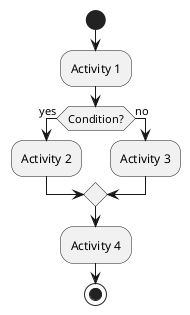

# 📊 Đề Xuất Chức Năng Chính Cho Biểu Đồ Hoạt Động (Activity Diagram)

## 🎯 Tổng Quan

Dựa trên kiến trúc microservices và các use case của hệ thống IELTS Platform, dưới đây là danh sách các chức năng chính nên được vẽ biểu đồ hoạt động:

---

## 1. 🔐 XÁC THỰC NGƯỜI DÙNG (Authentication)

### 1.1. Đăng Ký Tài Khoản
**Mô tả**: Flow đăng ký tài khoản mới với validation và role assignment

**Các bước chính**:
- Nhập thông tin (email, password, full_name, role)
- Validate input
- Kiểm tra email đã tồn tại
- Hash password
- Tạo user trong auth_db
- Tạo profile trong user_db
- Gửi email xác nhận (optional)
- Trả về access_token và refresh_token

**Services liên quan**: Auth Service, User Service

**Độ phức tạp**: ⭐⭐⭐ (Trung bình)

---

### 1.2. Đăng Nhập
**Mô tả**: Flow đăng nhập với JWT token generation

**Các bước chính**:
- Nhập email và password
- Validate input
- Tìm user trong auth_db
- Verify password
- Generate JWT access_token và refresh_token
- Lưu refresh_token vào database
- Trả về tokens và user info

**Services liên quan**: Auth Service

**Độ phức tạp**: ⭐⭐ (Đơn giản)

---

### 1.3. Refresh Token
**Mô tả**: Flow làm mới access token khi hết hạn

**Các bước chính**:
- Nhận refresh_token từ client
- Validate refresh_token
- Kiểm tra token trong database
- Generate access_token mới
- Trả về access_token mới

**Services liên quan**: Auth Service

**Độ phức tạp**: ⭐⭐ (Đơn giản)

---

## 2. 📚 QUẢN LÝ KHÓA HỌC (Course Management)

### 2.1. Đăng Ký Khóa Học (Enrollment)
**Mô tả**: Flow học viên đăng ký vào một khóa học

**Các bước chính**:
- Xem danh sách khóa học (filter, search)
- Xem chi tiết khóa học
- Kiểm tra enrollment type (free/premium)
- Nếu premium: Xử lý thanh toán (optional)
- Tạo enrollment record
- Cập nhật total_enrollments của course
- Gửi notification chào mừng
- Tạo initial progress records cho tất cả lessons
- Trả về enrollment info

**Services liên quan**: Course Service, User Service, Notification Service

**Độ phức tạp**: ⭐⭐⭐⭐ (Phức tạp)

---

### 2.2. Học Bài (Xem Video Lesson)
**Mô tả**: Flow học viên xem video lesson và tracking progress

**Các bước chính**:
- Chọn khóa học đã enroll
- Chọn module và lesson
- Kiểm tra quyền truy cập (enrolled, lesson is_free)
- Load lesson content (videos, materials)
- Load lesson progress (nếu có)
- Bắt đầu xem video
- Track video progress (watched_seconds, last_position)
- Cập nhật lesson progress (real-time hoặc periodic)
- Khi hoàn thành: Mark lesson as completed
- Cập nhật enrollment progress
- Gửi notification (nếu hoàn thành lesson)
- Cập nhật study session trong user service

**Services liên quan**: Course Service, User Service, Notification Service

**Độ phức tạp**: ⭐⭐⭐⭐⭐ (Rất phức tạp)

---

### 2.3. Tạo Khóa Học (Instructor)
**Mô tả**: Flow instructor tạo khóa học mới với modules và lessons

**Các bước chính**:
- Kiểm tra quyền (instructor/admin)
- Tạo course (draft status)
- Tạo modules cho course
- Tạo lessons cho từng module
- Thêm videos vào lessons (YouTube hoặc upload)
- Thêm materials vào lessons
- Publish course (chuyển status sang published)
- Sync video durations (nếu YouTube)
- Trả về course detail

**Services liên quan**: Course Service, YouTube Service, Storage Service

**Độ phức tạp**: ⭐⭐⭐⭐⭐ (Rất phức tạp)

---

## 3. ✍️ HỆ THỐNG BÀI TẬP (Exercise System)

### 3.1. Làm Bài Tập Listening/Reading
**Mô tả**: Flow học viên làm bài tập trắc nghiệm và nhận kết quả ngay

**Các bước chính**:
- Xem danh sách exercises (filter by skill, level, module)
- Chọn exercise
- Start attempt (tạo UserExerciseAttempt)
- Load questions và audio (nếu Listening)
- Hiển thị timer
- Học viên trả lời từng câu
- Submit answers
- Auto-grade (tính điểm cho từng câu)
- Tính tổng điểm và band score
- Lưu submission vào database
- Cập nhật progress trong user service
- Gửi notification kết quả
- Hiển thị kết quả chi tiết (đúng/sai, đáp án, giải thích)

**Services liên quan**: Exercise Service, User Service, Notification Service

**Độ phức tạp**: ⭐⭐⭐⭐ (Phức tạp)

---

### 3.2. Nộp Bài Writing
**Mô tả**: Flow nộp bài Writing và nhận đánh giá từ AI

**Các bước chính**:
- Chọn Writing exercise
- Start attempt
- Hiển thị đề bài và requirements
- Học viên viết essay
- Submit essay (text content)
- Validate word count (Task 1: 150+, Task 2: 250+)
- Lưu submission vào database
- Gọi AI Service để đánh giá (async)
- AI Service: Check cache trước
- Nếu cache miss: Gọi OpenAI API
- AI đánh giá 4 tiêu chí (Task Achievement, Coherence, Lexical, Grammar)
- Tính band score
- Lưu kết quả vào cache
- Cập nhật submission với kết quả
- Sync kết quả về User Service
- Gửi notification khi có kết quả
- Hiển thị feedback chi tiết cho học viên

**Services liên quan**: Exercise Service, AI Service, User Service, Notification Service

**Độ phức tạp**: ⭐⭐⭐⭐⭐ (Rất phức tạp - có async processing)

---

### 3.3. Nộp Bài Speaking
**Mô tả**: Flow nộp bài Speaking (audio) và nhận đánh giá từ AI

**Các bước chính**:
- Chọn Speaking exercise
- Start attempt
- Hiển thị đề bài
- Học viên ghi âm (hoặc upload audio file)
- Upload audio lên Storage Service (MinIO)
- Nhận presigned URL hoặc object key
- Submit với audio URL
- Validate audio file (size, duration, format)
- Lưu submission vào database
- Gọi AI Service để đánh giá (async)
- AI Service: Download audio từ Storage
- Transcribe audio (Whisper API)
- Evaluate speaking (GPT-4o) - Fluency, Pronunciation, Lexical, Grammar
- Tính band score
- Lưu kết quả vào cache
- Cập nhật submission với kết quả
- Sync kết quả về User Service
- Gửi notification khi có kết quả
- Hiển thị transcription và feedback

**Services liên quan**: Exercise Service, AI Service, Storage Service, User Service, Notification Service

**Độ phức tạp**: ⭐⭐⭐⭐⭐ (Rất phức tạp - có async processing và file upload)

---

## 4. 📊 THEO DÕI TIẾN ĐỘ (Progress Tracking)

### 4.1. Xem Tiến Độ Học Tập
**Mô tả**: Flow xem tổng quan tiến độ học tập và thống kê

**Các bước chính**:
- Load user profile
- Load learning progress (overall stats)
- Load skill statistics (Listening, Reading, Writing, Speaking band scores)
- Load study sessions (recent, total time)
- Load course enrollments và progress
- Load study goals và achievements
- Tính toán streaks và milestones
- Hiển thị dashboard với charts và graphs

**Services liên quan**: User Service, Course Service

**Độ phức tạp**: ⭐⭐⭐ (Trung bình)

---

### 4.2. Tạo Study Goal
**Mô tả**: Flow tạo mục tiêu học tập cá nhân

**Các bước chính**:
- Chọn loại goal (band score target, study hours, exercises completed)
- Nhập target value và deadline
- Lưu goal vào database
- Tạo reminder (nếu cần)
- Trả về goal info

**Services liên quan**: User Service, Notification Service

**Độ phức tạp**: ⭐⭐ (Đơn giản)

---

## 5. 🔔 HỆ THỐNG THÔNG BÁO (Notification System)

### 5.1. Nhận và Xem Thông Báo
**Mô tả**: Flow nhận và quản lý thông báo real-time

**Các bước chính**:
- User đăng nhập
- Connect SSE (Server-Sent Events) stream
- Subscribe vào notification channel
- Nhận real-time notifications (push, email, in-app)
- Hiển thị notification badge
- User click để xem chi tiết
- Mark as read
- Cập nhật notification status
- Unsubscribe khi logout

**Services liên quan**: Notification Service

**Độ phức tạp**: ⭐⭐⭐⭐ (Phức tạp - có real-time streaming)

---

## 6. 👤 QUẢN LÝ HỒ SƠ (Profile Management)

### 6.1. Cập Nhật Profile
**Mô tả**: Flow cập nhật thông tin cá nhân

**Các bước chính**:
- Load current profile
- Hiển thị form edit
- User cập nhật thông tin (full_name, avatar, bio, preferences)
- Validate input
- Cập nhật profile trong user_db
- Sync preferences với Notification Service (nếu có thay đổi)
- Trả về updated profile

**Services liên quan**: User Service, Notification Service

**Độ phức tạp**: ⭐⭐ (Đơn giản)

---

## 7. 🏆 XẾP HẠNG VÀ THÀNH TỰU (Leaderboard & Achievements)

### 7.1. Xem Leaderboard
**Mô tả**: Flow xem bảng xếp hạng học viên

**Các bước chính**:
- Load top learners từ user_db (join với auth_db qua dblink)
- Tính điểm dựa trên: band scores, study hours, exercises completed
- Sắp xếp theo ranking
- Hiển thị leaderboard với pagination
- Highlight current user position

**Services liên quan**: User Service, Auth Service (via dblink)

**Độ phức tạp**: ⭐⭐⭐ (Trung bình)

---

## 📋 ĐỀ XUẤT ƯU TIÊN VẼ BIỂU ĐỒ

### 🔥 Ưu Tiên Cao (Core Features)
1. **Đăng Ký Khóa Học** - Flow quan trọng nhất cho học viên
2. **Học Bài (Xem Video Lesson)** - Flow phức tạp với nhiều services
3. **Nộp Bài Writing** - Flow có async AI processing
4. **Nộp Bài Speaking** - Flow phức tạp nhất (file upload + AI)

### ⭐ Ưu Tiên Trung Bình
5. **Làm Bài Tập Listening/Reading** - Flow phổ biến
6. **Đăng Ký/Đăng Nhập** - Flow cơ bản nhưng quan trọng
7. **Xem Tiến Độ Học Tập** - Flow dashboard

### 📌 Ưu Tiên Thấp (Có thể bổ sung sau)
8. **Tạo Khóa Học** - Flow cho instructor
9. **Nhận và Xem Thông Báo** - Flow có real-time streaming
10. **Cập Nhật Profile** - Flow đơn giản

---

## 🎨 Gợi Ý Format Biểu Đồ

### Sử dụng PlantUML Activity Diagram:

### Các ký hiệu nên sử dụng:
- **Start/End**: Bắt đầu/kết thúc flow
- **Activity**: Các hành động
- **Decision**: Điều kiện rẽ nhánh (if/else)
- **Fork/Join**: Xử lý song song (async)
- **Swimlanes**: Phân chia theo service/actor
- **Notes**: Ghi chú cho các bước phức tạp

---

## 📝 Lưu Ý Khi Vẽ

1. **Xác định Actor**: Student, Instructor, Admin, System
2. **Xác định Swimlanes**: Mỗi service một lane (Auth, User, Course, Exercise, AI, Notification, Storage)
3. **Xử lý Async**: Sử dụng Fork/Join cho các tác vụ bất đồng bộ (AI evaluation)
4. **Error Handling**: Thêm các nhánh xử lý lỗi
5. **Validation**: Thêm các bước validate input
6. **Database Operations**: Có thể gộp hoặc chi tiết tùy mức độ
7. **External APIs**: Đánh dấu rõ các calls đến external services (OpenAI, YouTube)

---

## 🚀 Bước Tiếp Theo

1. Chọn 1-2 chức năng ưu tiên cao để bắt đầu vẽ
2. Xác định các services và actors liên quan
3. Vẽ draft biểu đồ với PlantUML
4. Review và refine
5. Thêm error handling và edge cases
6. Tạo documentation kèm theo

