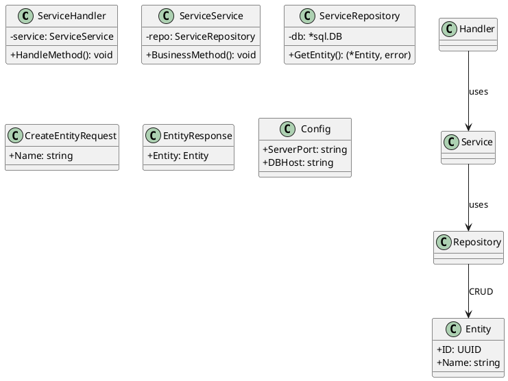

# Thứ Tự Các Layer Trong Sơ Đồ Lớp Pha Thiết Kế

## 📋 Tổng Quan

Trong sơ đồ lớp (Class Diagram) pha thiết kế cho một microservice, các layer được sắp xếp theo thứ tự từ **trên xuống dưới** theo nguyên tắc **dependency flow** (luồng phụ thuộc): từ layer phụ thuộc nhiều nhất (Handler) đến layer độc lập nhất (Config/Entity).

---

## 🎯 Thứ Tự Chuẩn Các Layer

### **1. Handler Layer (Presentation Layer)**
**Vị trí:** Trên cùng  
**Vai trò:** Lớp giao tiếp với client (HTTP requests/responses)

```
' ===== Handler Layer =====
class ServiceHandler {
  - service: ServiceService
  + HandleMethod1(c: *gin.Context): void
  + HandleMethod2(c: *gin.Context): void
}
```

**Lý do:**
- Đây là điểm vào (entry point) của service
- Phụ thuộc vào Service Layer
- Xử lý HTTP, validation, serialization

---

### **2. Service Layer (Business Logic Layer)**
**Vị trí:** Sau Handler Layer  
**Vai trò:** Chứa business logic, orchestration

```
' ===== Service Layer =====
class ServiceService {
  - repo: ServiceRepository
  - externalClient: ExternalServiceClient
  + BusinessMethod1(req: *RequestDTO): (*ResponseDTO, error)
  + BusinessMethod2(id: UUID): (*Entity, error)
}

class ExternalServiceClient {
  + CallExternalAPI(): void
}
```

**Lý do:**
- Phụ thuộc vào Repository Layer
- Có thể phụ thuộc vào các Service khác (External Clients)
- Chứa business logic chính

---

### **3. Repository Layer (Data Access Layer)**
**Vị trí:** Sau Service Layer  
**Vai trò:** Tương tác với database, CRUD operations

```
' ===== Repository Layer =====
class ServiceRepository {
  - db: *sql.DB
  + GetEntity(id: UUID): (*Entity, error)
  + CreateEntity(entity: *Entity): error
  + UpdateEntity(id: UUID, updates: map): error
  + DeleteEntity(id: UUID): error
}
```

**Lý do:**
- Phụ thuộc vào Entity Layer (làm việc với entities)
- Độc lập với business logic
- Chỉ xử lý data access

---

### **4. Entity Layer (Domain Model Layer)**
**Vị trí:** Sau Repository Layer  
**Vai trò:** Định nghĩa các domain models, database entities

```
' ===== Entity Layer =====
class Entity {
  + ID: UUID
  + Name: string
  + CreatedAt: time.Time
  + UpdatedAt: time.Time
}

class RelatedEntity {
  + ID: UUID
  + EntityID: UUID
  + Data: string
}
```

**Lý do:**
- Độc lập, không phụ thuộc vào layer nào
- Đại diện cho database schema
- Có thể có relationships giữa các entities

---

### **5. DTO Layer (Data Transfer Objects)**
**Vị trí:** Sau Entity Layer  
**Vai trò:** Định nghĩa các objects để transfer data giữa các layer

```
' ===== DTO Layer =====
class CreateEntityRequest {
  + Name: string
  + Description: *string
}

class UpdateEntityRequest {
  + Name: *string
  + Description: *string
}

class EntityDetailResponse {
  + Entity: Entity
  + RelatedData: []RelatedEntity
  + Metadata: map
}
```

**Lý do:**
- Độc lập, nhưng thường chứa Entities trong Response DTOs
- Tách biệt API contract khỏi database schema
- Có thể đặt sau Entity vì Response DTOs thường chứa Entities

---

### **6. Config Layer (Configuration Layer)**
**Vị trí:** Cuối cùng (trước Relationships)  
**Vai trò:** Định nghĩa cấu hình service

```
' ===== Config Layer =====
class Config {
  + ServerPort: string
  + DBHost: string
  + DBPort: string
  + DBUser: string
  + DBPassword: string
  + JWTSecret: string
  + ExternalServiceURL: string
}
```

**Lý do:**
- Hoàn toàn độc lập
- Được sử dụng bởi tất cả các layer
- Thường được inject vào các layer khác

---

### **7. Relationships Section**
**Vị trí:** Cuối cùng  
**Vai trò:** Định nghĩa các mối quan hệ giữa các classes

```
' ===== Relationships =====
Handler --> Service : uses
Service --> Repository : uses
Service --> ExternalClient : uses
Repository --> Entity : CRUD

Entity "1" -- "0..*" RelatedEntity : has
```

**Lý do:**
- Tổng hợp tất cả các mối quan hệ
- Giúp diagram dễ đọc và hiểu
- Thể hiện dependency flow rõ ràng

---

## 📊 Sơ Đồ Tổng Quan

```
┌─────────────────────────────────────┐
│  1. Handler Layer                   │ ← Entry Point (HTTP)
│  - ServiceHandler                   │
│  - InternalHandler (nếu có)          │
└──────────────┬──────────────────────┘
               │ uses
               ▼
┌─────────────────────────────────────┐
│  2. Service Layer                   │ ← Business Logic
│  - ServiceService                   │
│  - ExternalServiceClient            │
│  - HelperService (nếu có)           │
└──────────────┬──────────────────────┘
               │ uses
               ▼
┌─────────────────────────────────────┐
│  3. Repository Layer                │ ← Data Access
│  - ServiceRepository                │
└──────────────┬──────────────────────┘
               │ uses
               ▼
┌─────────────────────────────────────┐
│  4. Entity Layer                    │ ← Domain Models
│  - Entity                            │
│  - RelatedEntity                     │
│  - ...                               │
└─────────────────────────────────────┘

┌─────────────────────────────────────┐
│  5. DTO Layer                       │ ← Data Transfer
│  - CreateEntityRequest              │
│  - UpdateEntityRequest              │
│  - EntityDetailResponse             │
│  - ...                               │
└─────────────────────────────────────┘

┌─────────────────────────────────────┐
│  6. Config Layer                   │ ← Configuration
│  - Config                            │
└─────────────────────────────────────┘

┌─────────────────────────────────────┐
│  7. Relationships                   │ ← Dependencies
│  Handler --> Service                │
│  Service --> Repository             │
│  Entity relationships               │
└─────────────────────────────────────┘
```

---

## 🔄 Dependency Flow (Luồng Phụ Thuộc)

```
Handler (phụ thuộc nhiều nhất)
  ↓ depends on
Service
  ↓ depends on
Repository
  ↓ depends on
Entity (độc lập)
  ↑ used by
DTO (độc lập, nhưng chứa Entities)
Config (hoàn toàn độc lập)
```

---

## 📝 Template Chuẩn Cho PlantUML



---

## ✅ Best Practices

1. **Luôn bắt đầu với Handler Layer** - Đây là entry point
2. **Sắp xếp theo dependency flow** - Layer phụ thuộc đặt trước layer được phụ thuộc
3. **Entity Layer đặt trước DTO Layer** - Vì Response DTOs thường chứa Entities
4. **Config Layer đặt cuối** - Vì nó độc lập và được inject vào các layer khác
5. **Relationships section đặt cuối cùng** - Tổng hợp tất cả dependencies
6. **Sử dụng comments rõ ràng** - `' ===== Layer Name =====` để phân tách
7. **Nhóm các classes cùng loại** - Ví dụ: tất cả Request DTOs, tất cả Response DTOs

---

## 🎨 Ví Dụ Thực Tế

Xem các file:
- `docs/class-course-service-design.puml`
- `docs/class-exercise-service-design.puml`
- `docs/class-user-service-design.puml`
- `docs/class-notification-service-design.puml`
- `docs/class-ai-service-design.puml`
- `docs/class-storage-service-design.puml`

Tất cả đều tuân theo thứ tự chuẩn này.


